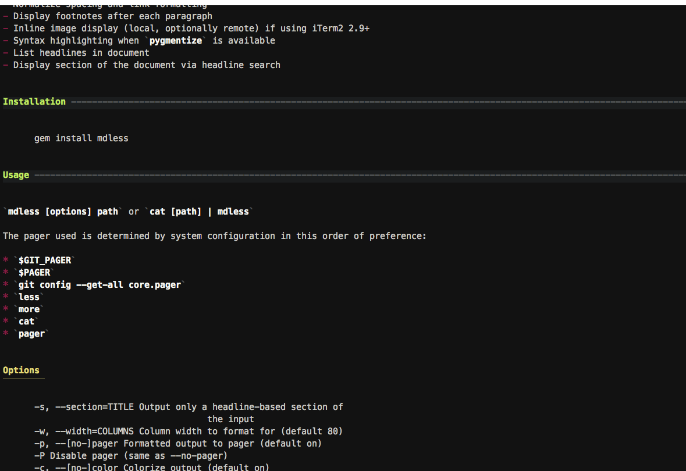

# mdless

<!--README-->

`mdless` is a utility that provides a formatted and highlighted view of Markdown files in Terminal.

I often use iTerm2 in visor mode, so `qlmanage -p` is annoying. I still wanted a way to view Markdown files quickly and without cruft.

<!--GITHUB--><!--END GITHUB-->
<!--JEKYLL-->

## Features

- Built in pager functionality with pipe capability, `less` replacement for Markdown files
- Format tables
- Colorize Markdown syntax for most elements
- Normalize spacing and link formatting
- Display footnotes after each paragraph
- Inline image display (local, optionally remote) (with compatible tools like imgcat or chafa)
- Syntax highlighting of code blocks when [Pygments](http://pygments.org/) is installed
- List headlines in document
    - Display single section of the document based on headlines
- Configurable Markdown options
- Customizable colors
- Add iTerm marks for h1-3 navigation when pager is disabled
- TaskPaper syntax detection and highlighting

## Installation

### Gem install

    gem install mdless

If you run into errors, try `gem install --user-install mdless`, or `sudo gem install mdless` (in that order).

### Homebrew

mdless is also available via Homebrew (directly).

    brew install mdless


### Dependencies

To render images, you need `imgcat` or `chafa` installed (`brew install chafa`).

For syntax highlighting, the `pygmentize` command must be available, part of the [Pygments](http://pygments.org/) package (`brew install pygments`).

## Usage

`mdless [options] path` or `cat [path] | mdless`

The pager used is determined by system configuration in this order of preference:

* `$PAGER`
* `less`
* `more`
* `cat`
* `pager`

### Options

    -c, --[no-]color                 Colorize output (default on)
    -d, --debug LEVEL                Level of debug messages to output (1-4, 4 to see all messages)
    -h, --help                       Display this screen
    -i, --images=TYPE                Include [local|remote (both)|none] images in output (requires chafa or imgcat, default none).
    -I, --all-images                 Include local and remote images in output (requires imgcat or chafa)
    -l, --list                       List headers in document and exit
    -p, --[no-]pager                 Formatted output to pager (default on)
    -P                               Disable pager (same as --no-pager)
    -s, --section=NUMBER[,NUMBER]    Output only a headline-based section of the input (numeric from --list)
    -t, --theme=THEME_NAME           Specify an alternate color theme to load
    -@, --at_tags                    Highlight @tags and values in the document
    -v, --version                    Display version number
    -w, --width=COLUMNS              Column width to format for (default: terminal width)
        --[no-]autolink              Convert bare URLs and emails to <links>
        --[no-]inline_footnotes      Display footnotes immediately after the paragraph that references them
        --[no-]intra-emphasis        Parse emphasis inside of words (e.g. Mark_down_)
        --[no-]lax-spacing           Allow lax spacing
        --links=FORMAT               Link style ([inline, reference, paragraph], default inline,
                "paragraph" will position reference links after each paragraph)
        --[no-]linebreaks            Preserve line breaks
        --[no-]syntax                Syntax highlight code blocks
        --taskpaper=OPTION           Highlight TaskPaper format (true|false|auto)
        --update_config              Update the configuration file with new keys and current command line options
        --[no-]wiki-links            Highlight [[wiki links]]

## Configuration

The first time mdless is run, a config file will be written to `~/.config/mdless/config.yml`, based on the command line options used on the first run. Update that file to make any options permanent (config options will always be overridden by command line flags).

```
---
:at_tags: true
:autolink: true
:color: true
:inline_footnotes: true
:intra_emphasis: false
:lax_spacing: true
:links: :paragraph
:local_images: true
:pager: true
:preserve_linebreaks: false
:remote_images: false
:syntax_higlight: true
:taskpaper: :auto
:theme: default
:width: 120
:wiki_links: true
```

- The `:at_tags` setting determines whether @tags will be highlighted. If this is enabled, colors will be pulled from the `at_tags` settings in the theme.
- `:autolink` will determine whether bare urls are turned into `<self-linking>` urls.
- `:color` will enable or disable all coloring.
- `:inline_footnotes` will determine the placement of footnotes. If true, footnotes will be added directly after the element that refers to them.
- `:intra_emphasis` will determine whether words containing underscores are rendered as italics or not.
- `:lax_spacing` determines whether a blank line is required around HTML elements.
- `:links` can be `inline`, `reference`, or `paragraph`. Paragraph puts reference links directly after the graf that refers to them.
- `:local_images` determines whether local images are processed using `chafa` or `imgcat` (whichever is available). `:remote_images` does the same for images referenced with web urls. If `:remote_images` is true, then `:local_images` is automatically enabled.
- `:pager` turns on or off pagination using `less` or closest available substitute.
- `:preserve_linebreaks` determines whether hard breaks within paragraphs are preserved. When converting to HTML, most Markdown processors will cause consecutive lines to be merged together, which is the default behavior for `mdless`. Turning this option on will cause lines to remain hard wrapped.
- `:syntax_highlight` will turn on/off syntax highlighting of code blocks (requires Pygments)
- `:taskpaper` determines whether a file is rendered as a TaskPaper document. This can be set to `:auto` to have TaskPaper detected from extension or content.
- `:theme` allows you to specify an alternate theme. See Customization below.
- `:width` allows you to permanantly set a width for wrapping of lines. If the width specified is greater than the available columns of the display, the display columns will be used instead.
- `:wiki_links` determines whether `[[wiki links]]` will be highlighted. If highlighted, colors are pulled from the `link` section of the theme.


## Customization

On first run a default theme file will be placed in `~/.config/mdless/mdless.theme`. You can edit this file to modify the colors mdless uses when highlighting your files. You can copy this file and create multiple theme options which can be specified with the `-t NAME` option. For example, create `~/.config/mdless/brett.theme` and then call `mdless -t brett filename.md`.

Colors are limited to basic ANSI codes, with support for bold, underline, italics (if available for the terminal/font), dark and bright, and foreground and background colors.

Customizeable settings are stored in [YAML](https://yaml.org) format. A chunk of the settings file looks like this:

```yaml
h1:
  color: b intense_black on_white
  pad: d black on_white
  pad_char: "="
```

Font and color settings are set using a string of color names and modifiers. A typical string looks like `b red on_white`, which would give you a bold red font on a white background. In the YAML settings file there's no need for quotes, just put the string following the colon for the setting.

You can also use 3 or 6-digit hex codes in place of color names. These can be prefixed with `bg` or `on_` to affect background colors, e.g. `bgFF0ACC`. The codes are case-insensitive and can be combined with emphasis modifiers like `b` or `u`.

Some extra (non-color) settings are available for certain keys, e.g. `pad_char` to define the right padding character used on level 1 and 2 headlines. Note that you can change the [Pygments](http://pygments.org/) theme used for syntax highlighting with the code_block.pygments_theme setting. For a list of available styles (assuming you have Pygments installed), use `pygmentize -L styles`.

The display of characters around emphasis and code spans can be configured. By default, the surrounding character for bold is `**`, italic is `_`, and code span is a backtick. You can leave these keys empty to not display characters at all. For triple-emphasized text, the text will be surrounded by italic and bold characters, in that order.

```yaml
emphasis:
  bold: b
  bold_character: "**"
  italic: u i
  italic_character: ""
  bold-italic: b u i
code_span:
  marker: b white
  color: b white on_intense_black
  character: ""
```

*Note:* the ANSI escape codes are reset every time the color changes, so, for example, if you have a key that defines underlines for the url in a link, the underline will automatically be removed when it gets to a bracket. This also means that if you define a background color, you'll need to define it again on all the keys that it should affect.

Base colors:

- black
- red
- green
- yellow
- blue
- magenta
- cyan
- white

Emphasis:

- b (bold)
- d (dark)
- i (italic)
- u (underline)
- r (reverse, negative)

To modify the emphasis, use 'b' (bold), 'i' (italic), 'u' (underline), e.g. `u yellow` for underlined yellow. These can be combined, e.g. `b u red`.

Use 'r' to reverse foreground and background colors. `r white on_black` would display as `black on_white`. 'r' alone will reverse the current color set for a line.

To set a background color, use `on_[color]` with one of the 8 colors. This can be used with foreground colors in the same setting, e.g. `white on_black`.

Use 'd' (dark) to indicate the darker version of a foreground color. On macOS (and possibly other systems) you can use the brighter version of a color by prefixing with "intense", e.g. `intense_red` or `on_intense_black`.

## Integrations

### Ranger

[Ranger](https://ranger.github.io) is a file manager that allows for quick navigation in the file hierarchy. A preview can be displayed for various file types. See docs at <https://github.com/ranger/ranger/wiki>.

mdless can be used in Ranger to preview Markdown and Taskpaper.

Ranger is installed with `brew install ranger`.

With `ranger --copy-config=scope` the configuration file for previews `scope.sh` is created in the directory `~/.config/ranger`.

The configuration file is already preconfigured. The following can be inserted above html to use mdless.

```
## Markdown
md|taskpaper)
mdless --taskpaper=auto -@ "${FILE_PATH}" && exit 5
;;
```

Thanks to Ralf Hülsmann for contributing!

### Gather

[Gather](https://brettterpstra.com/projects/gather-cli/) is a tool for converting web pages to Markdown. You can use it with mdless to create a Lynx-style web browser:

```bash
$ gather https://brettterpstra.com/projects/gather-cli/ | mdless
```

### fzf

[fzf](https://github.com/junegunn/fzf) is a tool for selecting files and other menu options with typeahead fuzzy matching. You can set up `mdless` as a previewer when selecting Markdown or TaskPaper files.

```
$ ls *.md | fzf --preview 'mdless {}'
```

### Fish

You can replace the cat command in Fish by creating the following functions in `~/.config/fish/functions`

`get_ext.fish`

```fish
function get_ext -d 'Get the file extension from the argument'
    set -l splits (string split "." $argv)
    echo $splits[-1]
end
```

`cat.fish`

```fish
function cat -d "Use bat instead of cat unless it's a Markdown file, then use mdless"
    set -l exts md markdown txt taskpaper

    if not test -f $argv[-1]
        echo "File not found: $argv[-1]"
        return 0
    end

    if contains (get_ext $argv[-1]) $exts
        mdless $argv
    else
        command bat --style plain --theme OneHalfDark $argv
    end
end
```

Note that if you do this, and you need uncolored output to pipe somewhere, you'll need to use `command cat FILE` to revert to the built-in `cat`. Otherwise your text will be full of the escape codes that `mdless` uses to colorize the output.

## Similar Projects

There are a few great options for Markdown viewing in the Terminal. If `mdless` doesn't do it for you, check out:

- [Glow](https://github.com/charmbracelet/glow)
- [Frogmouth](https://github.com/Textualize/frogmouth)

<!--END README-->
